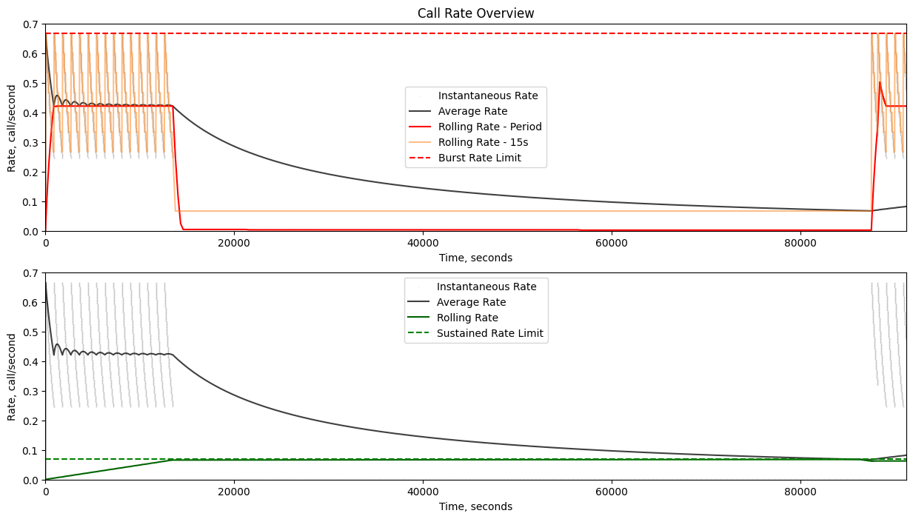
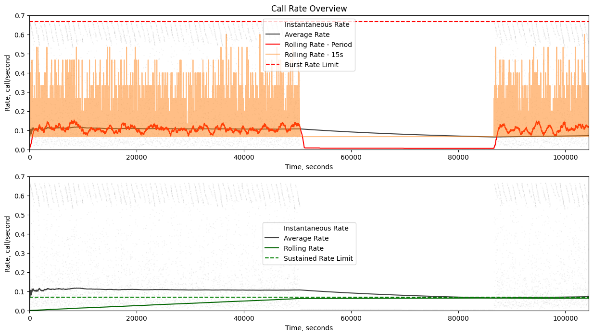

# Throttling using Generic Cell Rate Algorithm
Designed for limiting calls to APIs that have imposed rate limits.

[Wiki page on GCRA](https://en.wikipedia.org/wiki/Generic_cell_rate_algorithm)
    
The GCRA is an interesting approach to rate limiting in that it's storage is
minimal and requires only the storage of a single value in the simplest terms, the
Theoretical Arrival Time.

The Theoretical Arrival Time or TAT is the time at which the next call could be made 
that would not be blocked due to rate limits.

# Something new
## Priority levels
You can provide multiple levels of rate limiting and request a priority level during throttling.
Higher priority levels have access to levels at or below the priority level.  The system will
greedily select the earliest TAT from the store for use.  Each priority level can be given an allocation
of the total rate limit which is set globally.  

## Respecting Multiple Rate Limits with Fixed Period Windows
It is possible to include multiple rate limits and calls will be executed prioritizing burst traffic.  This is 
best suited for cases where the rate limits are imposed on static windows that are refreshed at the end of each period.
It is also, assumed that obtaining usage information for the period is possible and can be provided. Without usage
information, throttling can not take advantage of possible burst overhead and can only fall back to respecting the
slowest of the given rate limits.

Here is an example of a system with two rate limits imposed, a 600 per 15 minutes and a 6000 per 24 hours.
The calls were made as fast as the system would allow.

With the same rate limits imposed, here is an example with a simulated random request interval.

